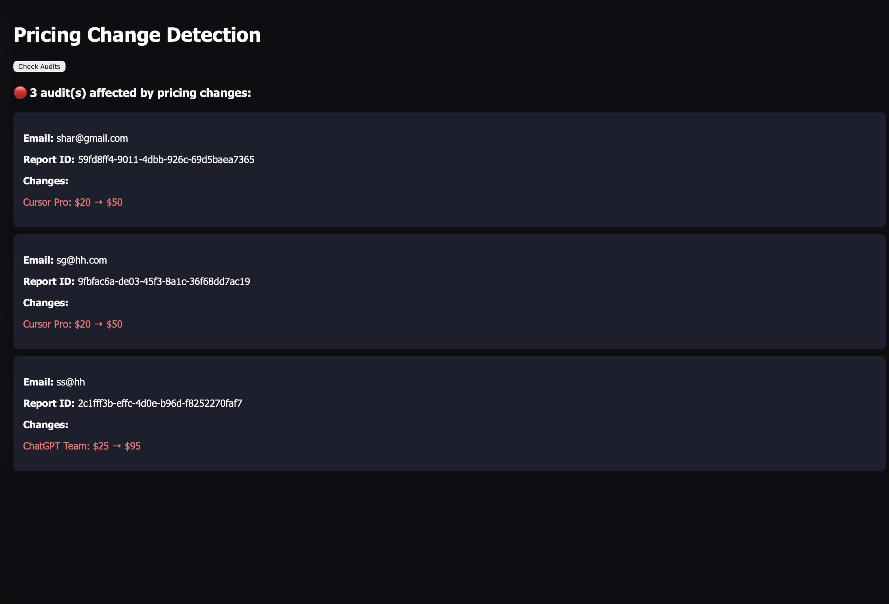

# SpendWise AI

SpendWise AI is a web application that helps startups and engineering teams audit their AI tool spending and identify potential cost savings.

The platform analyzes subscriptions such as ChatGPT, Claude, GitHub Copilot, Gemini, Cursor, and other AI services to provide recommendations for reducing unnecessary expenses.

---

## 📸 Screenshots

### Audit Form & Result

### Results Dashboard

### MultiTool&ShareableLink

### Shareable Report

### AdminPage_PricingDetection

### Email_Notification

### RerunPage_DiffView

---

## ⚡ Quick Start

### 1. Clone the repo

git clone <https://github.com/sharondillu/ai-audit>
cd ai-audit

⸻

### 2. Install dependencies
npm install

### 3. Setup environment variables

VITE_SUPABASE_URL=project_url

VITE_SUPABASE_ANON_KEY=anon_key

VITE_RESEND_API_KEY=your_resend_api_key

### 4. Run locally

npm run dev

### 5. Deploy

Netlify

## 🌐 Live Demo

## 👉 ROUND 1:Deployed URL: https://spendwise-ai-audit.netlify.app/
## 👉 ROUND 2:Deployed URL:https://deploy-preview-1--spendwise-ai-audit.netlify.app/

## 🧠 Key Features

### Round 1 — Core Audit
- Per-tool audit with savings recommendations
- Rule-based personalized summary (deterministic, no external AI API)
- Shareable public reports (/report/:id)
- Privacy-safe (no email/company in public view)
- Supabase-backed persistent audit storage
- Pricing snapshot saved with every audit

### Round 2 — Live Re-Audit System
- **Pricing change detection** — compares each saved audit's pricing 
  snapshot against current pricing to flag stale recommendations
- **Automated email notifications** — affected users receive an email 
  showing exactly what changed and how it impacts their audit, sent 
  via Supabase Edge Functions and Resend
- **Side-by-side diff view** — re-run link in email opens a comparison 
  of old vs updated recommendations with changes highlighted
- **One-click unsubscribe** — users can opt out of re-audit emails 
  directly from the email
- **Admin dashboard** — manual trigger to detect pricing changes across 
  all stored audits and send notifications

## ⚖️ Decisions (Trade-offs)

1. Rule-based summary vs AI API

Chose deterministic logic to ensure consistent, explainable output and avoid API cost.

2. JavaScript vs TypeScript

Used JavaScript to prioritize speed and iteration within the time constraint.

3. Supabase vs custom backend

Used Supabase for fast setup instead of building a backend from scratch.

4. Store audit_data vs recompute

Stored full audit result as JSON to ensure consistency across shared reports.

5. Client-side logic vs backend processing

Kept logic on frontend for simplicity; can be moved to backend for scaling.

6.Supabase Edge Function for email

Calling Resend directly from the browser causes CORS errors. Edge Function 
runs server-side, keeps API key secure in Supabase secrets.

7. Manual admin trigger vs cron job
Chose manual trigger for Round 2 to ship faster. Next step is scheduled 
pg_cron job for automated weekly detection.

---

### Data Flow

User fills AuditForm
↓
generateAudit() runs in auditEngine.js
↓
Result shown in ResultCard
↓
User saves with email → stored in Supabase
(audit_result + input_stack + pricing_snapshot saved)
↓
Shareable link generated → /report/:id

--- Round 2 ---

Admin clicks Check Audits
↓
detectPricingChanges() compares pricing_snapshot vs current PRICING
↓
Affected audits flagged → Supabase Edge Function sends email via Resend
↓
User clicks email link → /rerun/:id
↓
RerunPage fetches original audit + reruns with current pricing
↓
Side-by-side diff shown with changes highlighted

## 🏗️ Architecture

See 👉 ARCHITECTURE.md

## 📊 Metrics & GTM

See:

metrics.md
gtm.md
economic.md

## 🧪 Testing

See 👉 tests.md

## 🔐 Security Note

Supabase anon key is used (public-safe)
.env file is not committed
Public reports exclude sensitive data

## 🚧 Limitations

Static Open Graph tags (no dynamic previews)
Simplified pricing assumptions
No authentication layer

## 🔮 Future Improvements

Dynamic OG tags for better sharing previews
Improved pricing models
User dashboard for saved audits
Backend API for scaling

## 🏁 Status

✔ Audit logic complete
✔ Summary system implemented
✔ Shareable links working
✔ Supabase integrated

## 📄 Documentation

ARCHITECTURE.md
REFLECTION.md
PROMPT.md
LANDING_COPY.md

## 🎯 Conclusion

AI Audit demonstrates strong product thinking, deterministic logic, and real-world SaaS patterns like shareable results, persistence, and clear UX.

---

## Project Goal

The goal of SpendWise AI is to help startups understand whether they are overspending on AI subscriptions and suggest better pricing alternatives.

## Author

Sharon Rose
GitHub: https://github.com/sharondillu

